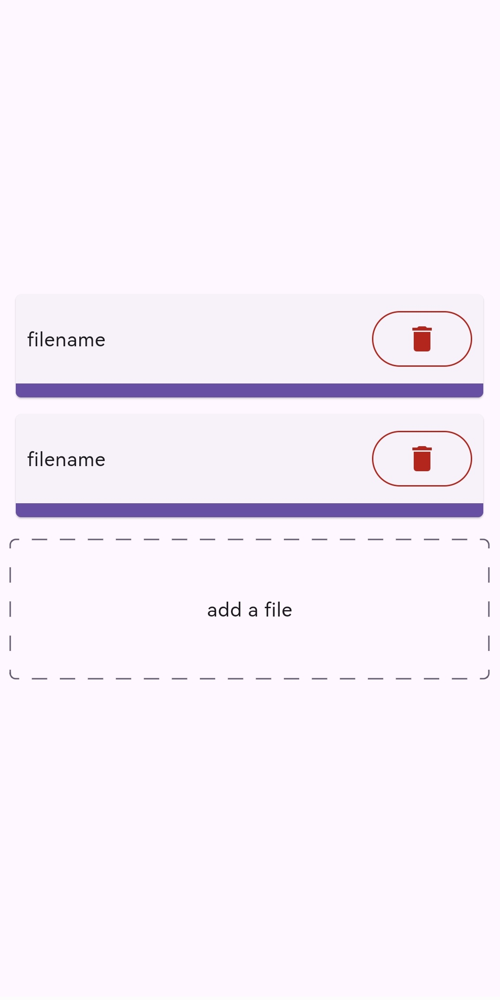

# Flutter File Uploader

[![License: MIT][license_badge]][license_link]
[![coverage][coverage_badge]][coverage_badge]

## Features

**This package use [en_file_uploader](https://pub.dev/packages/en_file_uploader) and provides widgets for displaying and managing file uploads.**

`FileUploader` is a widget that encapsulates the logic for adding and removing files to be uploaded. Each file can have its own `IFileUploadHandler` for customized uploads (More info about handlers [here](https://pub.dev/packages/en_file_uploader)).

`FileCard` is a file upload widget agnostic of `en_file_uploader`, while `FileUploadControllerProvider` is a provider that encapsulates the business logic for uploading a file: status (loading,done,...), progress.

`ProvidedFileCard` combines `FileCard` with `FileUploadControllerProvider`.

## Usage

If you want to focus solely on UI details, you can use `FileUploader` and `ProvidedFileCard`.

`FileUploader` handles the logic for adding and removing files to be uploaded.
`ProvidedFileCard` displays the `FileCard` widget and manages the actions related to uploading, retrying, and removing individual files.

```dart
FileUploader(
    builder: (context, ref) {
        // for each file a ref is created using the provided `IFileUploadHandler`.
        // Here, a widget for managing file uploads should be inserted.
        // ProvidedFileCard automatically provides complete file management and allows for graphical customization.
        // To manage the upload while creating your own widget, use only FileUploadControllerProvider. For just the UI, use FileCard.
        return ProvidedFileCard(
            ref: ref,
            content: Text("filename"),
        );
    },
    onPressedAddFiles: () async {
        // on tap add a list of files
    },
    onFileAdded: (file) async {
        // for each file added create a custom `IFileUploadHandler`
    },
    onFileUploaded: (file) {
        print("file uploaded ${file.id}");
    },
    onFileRemoved: (file) {
        print("file removed ${file.id}");
    },
    placeholder: Text("add a file"),
),
```

---

Alternatively, in the [FileUploader.builder] callback you can create your custom widget using the ref parameter to manage uploading, retrying, and removing files. You can use `FileCard` as the base widget for displaying file upload details.

```dart
FileUploader(
    builder: (context, ref) {
        // for each file a ref is created using the provided `IFileUploadHandler`.
        // Here, a widget for managing file uploads should be inserted.

        return MyCustomFileCard(
            ref: ref,
        );
    },
    onPressedAddFiles: () async {
        // on tap add a list of files
    },
    onFileAdded: (file) async {
        // for each file added create a custom `IFileUploadHandler`
        // More info about handlers on [en_file_uploader](https://pub.dev/packages/en_file_uploader)
    },
    onFileUploaded: (file) {
        print("file uploaded ${file.id}");
    },
    onFileRemoved: (file) {
        print("file removed ${file.id}");
    },
    placeholder: Text("add a file"),
),
```

## Examples

In the [example](./example/) project, you can see some uses of `en_file_uploader` and `flutter_file_uploader`.

---

In the [handlers](./example/lib/handlers/) folder, there are some `IFileUploadHandler` for simulating file uploads.

In the [examples](./example/lib/examples/) folder, you can find practical uses:

- **default**: The simplest case that uses `FileUploader` and `ProvidedFileCard`;
- **default_restorable_chunked**: Same as **default** but using a different handler: `InMemoryRestorableChunkedFileUploadHandler`;
- **self_ref_management**: Custom file upload state management (no `ProvidedFileCard`).

## Widgets

### FileUploader

`FileUploader` is a widget that encapsulates the logic for adding and removing files to be uploaded. Each file can have its own `IFileUploadHandler` for customized uploads.

### Providers

Widgets that use the [provider](https://pub.dev/packages/provider) library to insert and consume `FileUploadControllerModel`.

- `FileUploadControllerProvider`: `ChangeNotifierProvider` with `FileUploadControllerModel`
- `FileUploadControllerSelector`: `Selector` with `FileUploadControllerModel`
- `FileUploadControllerConsumer`: `Consumer` with `FileUploadControllerModel`

### FileCard

A card that displays the progress of a file upload.

### ProvidedFileCard

`FileCard` + `FileUploadControllerProvider` + `FileUploadControllerConsumer`

## Screenshot

|                                                                   |                                                              |
| ----------------------------------------------------------------- | ------------------------------------------------------------ |
|  |  |

[license_badge]: https://img.shields.io/badge/license-MIT-blue.svg
[license_link]: https://opensource.org/licenses/MIT
[coverage_badge]: https://img.shields.io/badge/coverage-100%25-green
